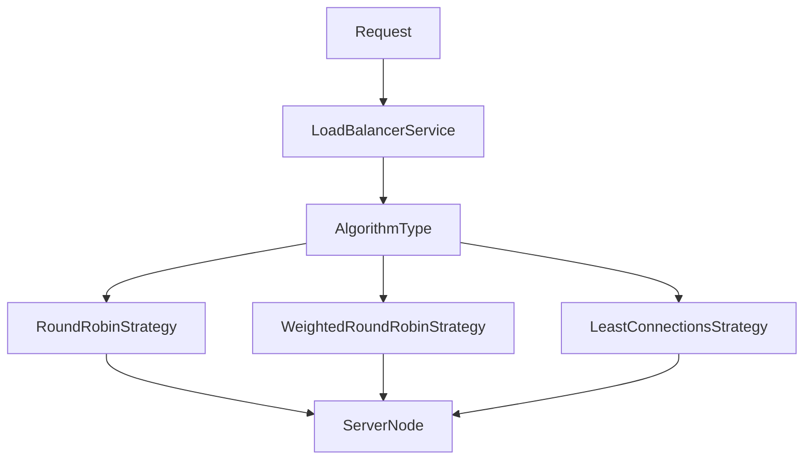

# Strategy Pattern

The backend uses the Strategy Pattern to support multiple load balancing algorithms without changing the request processing workflow.

Instead of placing all routing logic inside `LoadBalancerService`, each algorithm is implemented as a separate strategy class that follows a common interface.

This allows the active routing algorithm to be changed at runtime while keeping the remaining request pipeline unchanged.

---

# Strategy Interface

All routing algorithms implement the same interface:

```text
LoadBalancingStrategy
```

Each implementation receives the list of available servers and returns the selected `ServerNode`.

---

# Current Implementations

```text
LoadBalancingStrategy
│
├── RoundRobinStrategy
├── WeightedRoundRobinStrategy
└── LeastConnectionsStrategy
```

---

# Runtime Selection

`LoadBalancerService` stores the currently selected routing algorithm using `AlgorithmType`.

During request processing, it selects the corresponding strategy and delegates the server selection task.



---

# Benefits

The Strategy Pattern provides the following advantages:

- Routing algorithms remain independent.
- New algorithms can be added without modifying existing implementations.
- `LoadBalancerService` manages the routing workflow while strategies focus only on server selection.
- Switching algorithms requires changing only the active `AlgorithmType`.

---

# Adding a New Algorithm

To introduce another routing strategy:

1. Create a new class implementing `LoadBalancingStrategy`.
2. Implement the server selection logic.
3. Add a corresponding value to `AlgorithmType`.
4. Update `LoadBalancerService` to use the new strategy.

No changes are required in the frontend or simulator.

---

# Implementation Files

| File | Responsibility |
|------|----------------|
| LoadBalancingStrategy.java | Strategy interface |
| AlgorithmType.java | Available routing algorithms |
| LoadBalancerService.java | Selects the active strategy |
| RoundRobinStrategy.java | Sequential routing |
| WeightedRoundRobinStrategy.java | Weight-based routing |
| LeastConnectionsStrategy.java | Connection-based routing |