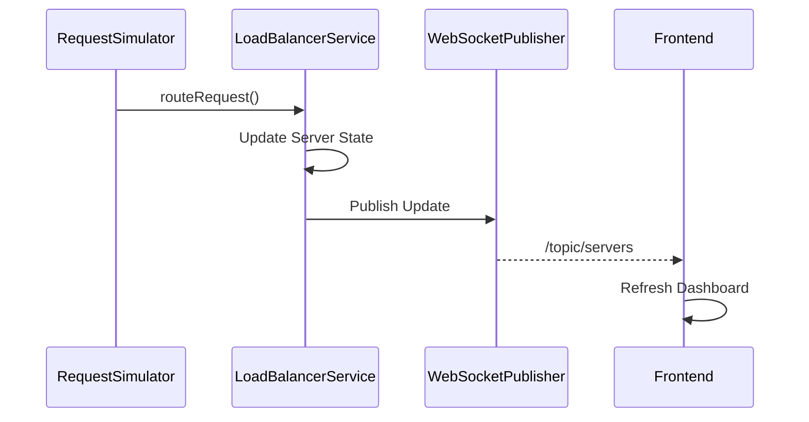

# WebSocket Communication

The application uses WebSockets to synchronize the frontend dashboard with the backend.

Whenever the backend updates the state of a simulated server, the latest information is published immediately to all connected clients.

This eliminates the need for periodic polling.

---

# Components

The WebSocket implementation consists of:

| Component | Responsibility |
|-----------|----------------|
| WebSocketConfig | Registers the WebSocket endpoint |
| WebSocketPublisher | Publishes server updates |
| websocketService.ts | Receives backend updates |

---

# Communication Flow



---

# Published Topic

The backend publishes server updates to:

```text
/topic/servers
```

The frontend subscribes to this topic during application startup.

---

# Update Process

Whenever a request is routed:

1. `LoadBalancerService` updates the selected server.
2. `WebSocketPublisher` broadcasts the updated server list.
3. The frontend receives the message.
4. Dashboard components refresh automatically.

---

# Why WebSockets?

The simulator continuously changes the state of backend servers.

Using REST polling would require repeated requests from the frontend.

WebSockets allow the backend to push updates only when the application state changes, reducing unnecessary network traffic while keeping the dashboard synchronized.

---

# Implementation Files

| File | Responsibility |
|------|----------------|
| WebSocketConfig.java | WebSocket configuration |
| WebSocketPublisher.java | Publish updates |
| websocketService.ts | Receive updates |