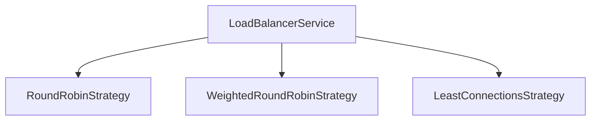
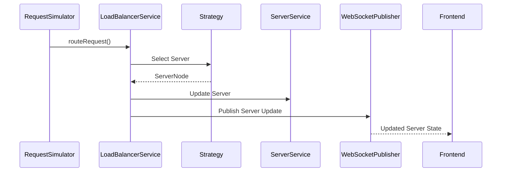

# Backend Architecture

The backend is implemented using **Spring Boot** and contains the complete request routing logic for the simulator.

It is responsible for:

- Managing backend servers
- Routing incoming requests
- Executing load balancing algorithms
- Running the traffic simulator
- Publishing WebSocket updates
- Providing analytics through REST APIs

The frontend does not make routing decisions. All business logic is executed inside the backend.

---

# Package Structure

```
com.loadbalancer
│
├── config
├── controller
├── dto
├── model
├── service
├── simulator
├── strategy
├── websocket
└── LoadbalancerBackendApplication
```

Each package has a single responsibility.

---

# Backend Layers

| Package | Responsibility |
|----------|----------------|
| config | CORS and WebSocket configuration |
| controller | REST API endpoints |
| dto | API response objects |
| model | Domain models |
| service | Business logic |
| simulator | Automatic request generation |
| strategy | Load balancing algorithms |
| websocket | Real-time event publishing |

---

# Controller Layer

Controllers expose REST endpoints that are consumed by the frontend.

Current controllers:

| Controller | Purpose |
|------------|---------|
| LoadBalancerController | Route requests and change routing algorithm |
| ServerController | Manage simulated backend servers |
| SimulationController | Start and stop request simulation |
| AnalyticsController | Return analytics information |
| RequestController | Return generated requests |
| WebSocketTestController | Trigger WebSocket updates for testing |

Controllers only receive requests and delegate processing to services.

---

# LoadBalancerService

`LoadBalancerService` is the central component of the backend.

Every request generated by the simulator eventually passes through this service.

Its responsibilities include:

- Maintaining the active routing algorithm
- Selecting the routing strategy
- Routing incoming requests
- Tracking the total number of routed requests
- Updating server connection counts
- Publishing updated server information

The service keeps the currently selected algorithm using:

```java
private AlgorithmType currentAlgorithm =
        AlgorithmType.ROUND_ROBIN;
```

Whenever a request is routed, the service selects the corresponding strategy based on `currentAlgorithm`.

---

# Routing Strategy Selection

The routing workflow is implemented using the Strategy Pattern.



Each strategy returns the selected `ServerNode`.

The remaining routing workflow continues inside `LoadBalancerService`.

---

# ServerService

`ServerService` manages the simulated backend servers.

Its responsibilities include:

- Returning all servers
- Adding a server
- Removing a server
- Enabling a server
- Disabling a server
- Resetting active connections

The routing algorithms do not modify the server collection directly.

All server management operations are handled by this service.

---

# Request Simulator

Traffic generation is implemented in:

```
simulator/RequestSimulator.java
```

The simulator uses Spring Scheduling.

```java
@Scheduled(fixedRate = 2000)
```

Every two seconds, if the simulation is running:

1. A new `RequestData` object is created.
2. The request is stored in a `ConcurrentLinkedQueue`.
3. The request is forwarded to `LoadBalancerService`.

The simulator is responsible only for generating traffic.

It does not select the destination server.

---

# Request Queue

Generated requests are stored in memory.

```java
ConcurrentLinkedQueue<RequestData>
```

The queue is exposed through `RequestController`, allowing the frontend to display recently generated requests.

---

# WebSocket Publisher

After a request has been routed, `LoadBalancerService` publishes the updated server state through `WebSocketPublisher`.

This allows connected frontend clients to refresh automatically without repeatedly calling the REST API.

---

# Request Processing Pipeline



---

# Design Decisions

The backend separates responsibilities across different layers.

- Controllers expose APIs.
- Services implement business logic.
- Strategies perform server selection.
- The simulator generates requests.
- WebSocketPublisher handles real-time communication.

This structure keeps routing logic independent from simulation and presentation.

---

# Key Classes

| Class | Responsibility |
|--------|----------------|
| LoadbalancerBackendApplication | Spring Boot entry point |
| LoadBalancerService | Coordinates request routing |
| ServerService | Maintains simulated servers |
| RequestSimulator | Generates requests |
| RoundRobinStrategy | Round Robin routing |
| WeightedRoundRobinStrategy | Weighted Round Robin routing |
| LeastConnectionsStrategy | Least Connections routing |
| WebSocketPublisher | Sends server updates |
| AnalyticsController | Returns analytics data |
