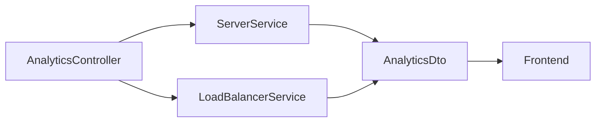
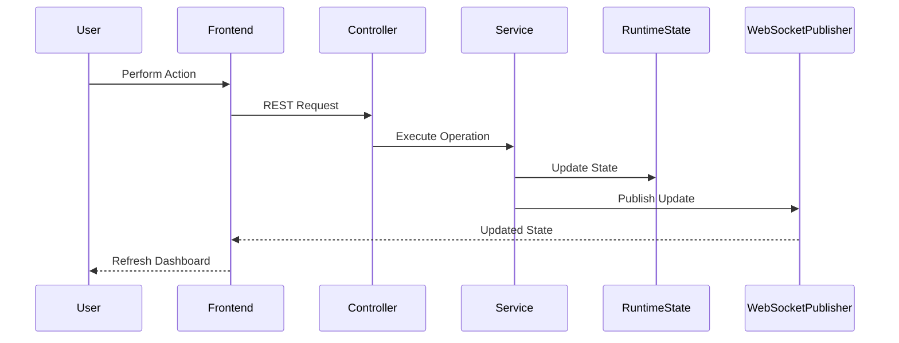

# Application Data Flow

The application maintains its runtime state entirely within the backend. The frontend retrieves this state using REST APIs and receives updates through WebSocket events.

The backend acts as the single source of truth for:

- Server information
- Routing algorithm
- Simulation status
- Request queue
- Analytics

The frontend displays this information but does not modify it directly.

---

# Data Flow Overview

```mermaid
flowchart LR

User

--> Frontend

Frontend

--> REST APIs

REST APIs

--> Spring Boot Backend

Spring Boot Backend

--> Runtime State

Runtime State

--> WebSocketPublisher

WebSocketPublisher

--> Frontend
```

---

# Runtime State

The backend maintains the following information during execution.

| Data | Maintained By |
|------|---------------|
| Server List | ServerService |
| Active Algorithm | LoadBalancerService |
| Total Requests | LoadBalancerService |
| Request Queue | RequestSimulator |
| Simulation Status | RequestSimulator |
| Active Connections | ServerNode |

No runtime data is permanently stored.

---

# Server Information

The server list is managed by:

```
ServerService
```

Each server maintains information such as:

- Server ID
- Weight
- Active status
- Current connections

Whenever a routing operation updates a server, the latest state becomes available to both the REST API and WebSocket publisher.

---

# Request Queue

Every generated request is stored inside:

```
ConcurrentLinkedQueue<RequestData>
```

The queue is managed by `RequestSimulator`.

The frontend retrieves recent requests through:

```
GET /api/requests
```

The queue exists only while the application is running.

---

# Routing Algorithm

The currently selected routing algorithm is maintained inside:

```
LoadBalancerService
```

The active value is represented by:

```
AlgorithmType
```

Changing the algorithm updates only this value.

The remainder of the routing workflow remains unchanged.

---

# Analytics Flow

Analytics are generated when the frontend requests:

```
GET /api/analytics
```

The controller gathers information from existing backend components instead of maintaining a separate analytics store.



The response includes:

- Total Requests
- Active Servers
- Total Connections
- Current Algorithm

---

# Simulation State

Simulation status is maintained by:

```
RequestSimulator
```

The simulator controls:

- Running state
- Request generation
- Request queue

`SimulationController` starts and stops the simulator using the available service methods.

---

# WebSocket Data Flow

After a request has been routed, `LoadBalancerService` updates the selected server and notifies `WebSocketPublisher`.

The publisher broadcasts the updated server list to:

```
/topic/servers
```

The frontend receives the message through:

```
websocketService.ts
```

Dashboard components are then refreshed using the latest server information.

---

# Complete Data Flow



---

# Data Ownership

Each type of application data has a single owner.

| Data | Owner |
|------|-------|
| Server List | ServerService |
| Routing Algorithm | LoadBalancerService |
| Request Queue | RequestSimulator |
| Simulation Status | RequestSimulator |
| Analytics Response | AnalyticsController |
| Dashboard State | Frontend |

This avoids duplicate state and keeps the application synchronized.

---

# Design Decisions

The application keeps runtime state inside backend services.

The frontend requests information when needed and listens for WebSocket updates to remain synchronized.

This approach keeps business logic centralized while allowing the frontend to focus on visualization.
