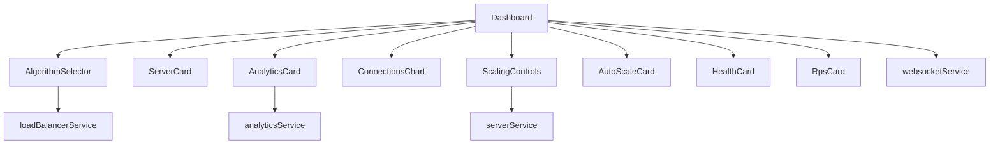
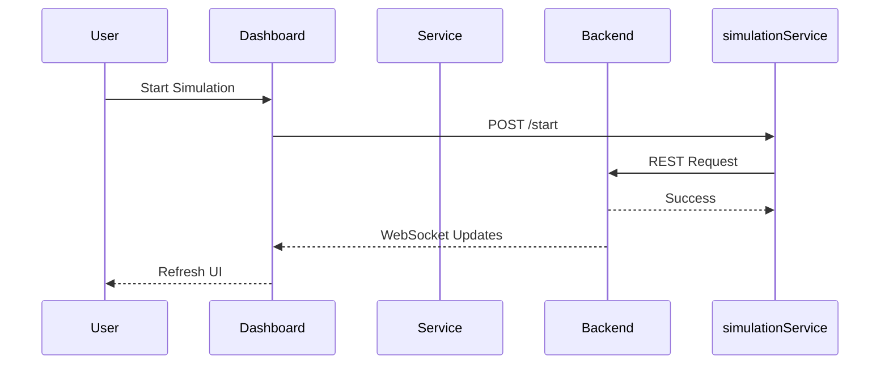

# Frontend Architecture

The frontend is built using **Next.js** and **TypeScript**. It provides the user interface for controlling the simulator and visualizing request distribution in real time.

Unlike the backend, the frontend does not perform routing decisions. It acts as a presentation layer that interacts with the backend through REST APIs and WebSocket events.

---

# Project Structure

```
frontend
│
├── app
├── components
├── services
├── hooks
├── types
├── public
└── styles
```

Each directory has a specific responsibility.

---

# Directory Overview

| Directory | Responsibility |
|-----------|----------------|
| app | Application pages and layout |
| components | Reusable UI components |
| services | REST API and WebSocket communication |
| hooks | Shared React hooks |
| types | Shared TypeScript interfaces |
| public | Static assets |

---

# Component Layer

The user interface is built using reusable React components.

Current components include:

| Component | Purpose |
|-----------|---------|
| AlgorithmSelector | Selects the active routing algorithm |
| ServerCard | Displays server information |
| AnalyticsCard | Displays runtime statistics |
| ConnectionsChart | Visualizes server connections |
| RequestTrendChart | Displays request activity |
| AutoScaleCard | Displays scaling controls |
| HealthCard | Displays server health |
| RpsCard | Displays request statistics |
| ScalingControls | Adds or removes simulated servers |
| SystemDiagram | Displays the system architecture |

Each component focuses on rendering a specific part of the dashboard.

---

# Service Layer

All communication with the backend is handled through dedicated service modules.

Current services include:

```
analyticsService.ts

loadBalancerService.ts

serverService.ts

simulationService.ts

scalingService.ts

websocketService.ts
```

Keeping communication logic inside services prevents HTTP requests from being scattered across UI components.

---

# REST Communication

User actions are translated into REST API requests.

Examples include:

- Selecting a routing algorithm
- Starting the simulator
- Stopping the simulator
- Adding servers
- Removing servers
- Loading analytics

The frontend never accesses backend classes directly.

---

# WebSocket Communication

A persistent WebSocket connection is established when the application loads.

The frontend subscribes to backend updates and refreshes the dashboard whenever new server information is published.

The WebSocket connection is managed by:

```
services/websocketService.ts
```

This keeps messaging logic independent from UI rendering.

---

# Component Communication

The following diagram illustrates how frontend components interact with backend services.



---

# State Management

The frontend stores only the state required to render the interface.

Examples include:

- Current server list
- Analytics response
- Selected routing algorithm
- Simulation status

The backend remains the source of truth for all runtime data.

Whenever the backend changes state, the frontend receives updated information through REST responses or WebSocket messages.

---

# Request Flow

The following sequence describes a typical user interaction.



---

# Design Principles

The frontend follows a component-based architecture.

Key design decisions include:

- Reusable UI components
- Dedicated service layer
- Separation of rendering and communication
- Strong typing using TypeScript
- Real-time synchronization through WebSockets

---

# Key Files

| File | Responsibility |
|------|----------------|
| page.tsx | Main dashboard |
| websocketService.ts | WebSocket communication |
| analyticsService.ts | Analytics API |
| simulationService.ts | Simulation control |
| serverService.ts | Server management |
| loadBalancerService.ts | Routing APIs |
| scalingService.ts | Scaling operations |

---

# Summary

The frontend is organized around reusable components and dedicated service modules. Components focus on rendering the user interface, while services manage communication with the backend through REST APIs and WebSockets. This separation keeps the frontend maintainable and makes it easier to introduce new dashboard features without affecting existing functionality.