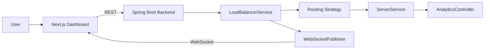

# System Overview

The application consists of a frontend dashboard and a backend simulation engine.

The backend performs request routing, traffic simulation, analytics generation, and WebSocket communication. The frontend provides controls for interacting with the simulator and visualizes the current system state.

---

# High-Level Architecture



---

# System Components

| Component | Responsibility |
|-----------|----------------|
| Next.js Frontend | Dashboard and user interaction |
| Spring Boot Backend | Core application logic |
| LoadBalancerService | Coordinates request routing |
| Routing Strategies | Select the destination server |
| ServerService | Maintains backend server information |
| RequestSimulator | Generates simulated requests |
| AnalyticsController | Returns runtime statistics |
| WebSocketPublisher | Sends server updates to connected clients |

---

# Application Workflow

The following sequence describes the overall application workflow.

1. The user starts the simulation from the dashboard.
2. `SimulationController` starts `RequestSimulator`.
3. `RequestSimulator` generates a new request every scheduled cycle.
4. `LoadBalancerService` routes the request using the active strategy.
5. `ServerService` updates the selected server.
6. `WebSocketPublisher` broadcasts the updated server state.
7. The frontend refreshes the dashboard using the received WebSocket message.

---

# Communication Model

The application uses two communication mechanisms.

| Communication | Purpose |
|---------------|---------|
| REST APIs | User actions such as starting the simulator, changing algorithms and managing servers |
| WebSockets | Real-time server updates after request routing |

REST is used for command-based operations, while WebSockets keep the dashboard synchronized with backend state.

---

# Architectural Characteristics

The application follows a layered architecture.

```text
Frontend

↓

REST API

↓

Controllers

↓

Services

↓

Strategies

↓

Server State

↓

WebSocket

↓

Frontend
```

Business logic remains in the backend, while the frontend focuses on presenting the current application state.

---

# Key Design Decisions

The implementation separates responsibilities across dedicated components.

- Controllers expose REST endpoints.
- Services implement business logic.
- Strategies perform server selection.
- The simulator generates traffic.
- WebSocketPublisher handles real-time communication.

This separation keeps the routing workflow modular and simplifies future enhancements.
