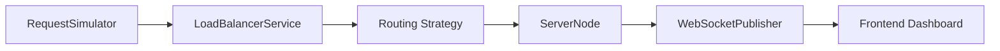
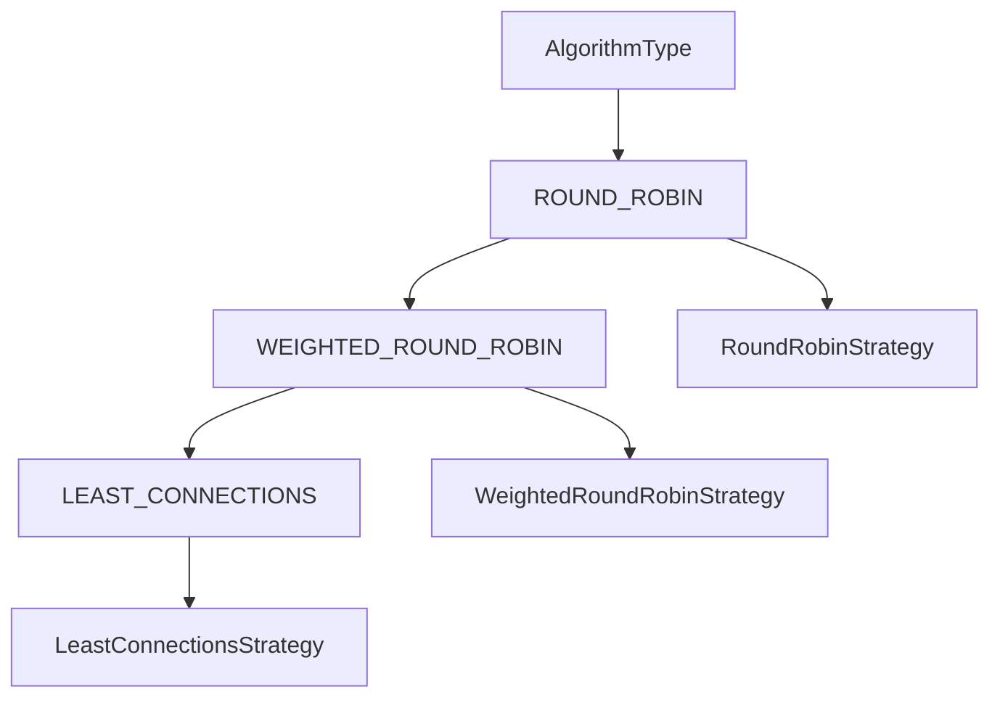
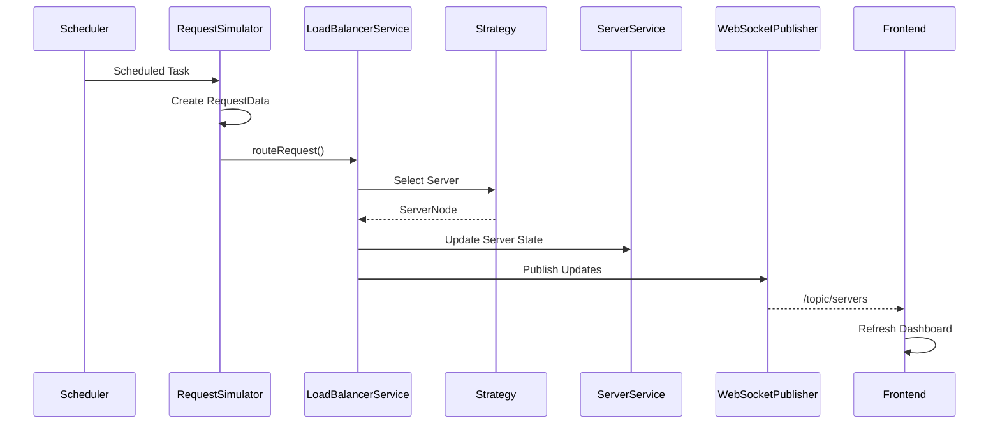

# Request Processing Pipeline

This document describes how a simulated request is processed inside the application.

A request generated by the simulator follows a fixed execution path. Each component has a single responsibility, making the routing process easier to understand and maintain.

---

# Processing Overview



---

# Step 1 — Request Generation

The request lifecycle begins in:

```
simulator/RequestSimulator.java
```

When the simulation is running, Spring executes the scheduled task every **2 seconds**.

```java
@Scheduled(fixedRate = 2000)
```

For each execution:

- A new `RequestData` object is created.
- The request is assigned a unique identifier.
- The request is stored in a `ConcurrentLinkedQueue`.
- The request is forwarded to `LoadBalancerService`.

The simulator is responsible only for generating requests.

---

# Step 2 — Routing Request

The generated request is passed to:

```java
LoadBalancerService.routeRequest()
```

This method coordinates the complete routing process.

Its responsibilities include:

- Reading the active routing algorithm.
- Selecting the appropriate strategy.
- Updating the selected server.
- Incrementing the total request count.
- Publishing updated server information.

All routing operations pass through this service.

---

# Step 3 — Selecting the Routing Strategy

The routing algorithm is selected using the current `AlgorithmType`.



Each strategy returns a `ServerNode`.

The strategy is responsible only for choosing the destination server.

---

# Step 4 — Updating Server State

After a server has been selected, `LoadBalancerService` updates its runtime state.

The service:

- Increments the active connection count.
- Updates the total routed request count.
- Keeps the latest server information available for analytics.

The routing strategies do not update server information directly.

---

# Step 5 — Publishing Updates

Once routing is complete, the updated server list is published through:

```
WebSocketPublisher
```

The publisher broadcasts the latest server state to subscribed frontend clients.

Topic:

```
/topic/servers
```

---

# Step 6 — Frontend Refresh

The frontend receives the published message through:

```
services/websocketService.ts
```

The updated information is used to refresh:

- Server cards
- Analytics cards
- Connection charts
- Request visualization

No additional REST request is required.

---

# Complete Execution Flow



---

# Component Responsibilities

| Component | Responsibility |
|-----------|----------------|
| RequestSimulator | Generates simulated requests |
| LoadBalancerService | Coordinates request routing |
| Routing Strategy | Selects the destination server |
| ServerService | Maintains server information |
| WebSocketPublisher | Publishes real-time updates |
| Frontend | Displays the latest application state |

---

# Error Handling

If no active server is available, the routing process stops and the request cannot be assigned.

If the simulation is not running, `RequestSimulator` skips request generation until the simulation is started again.

---

# Design Characteristics

The request processing pipeline follows a clear separation of responsibilities.

- Request generation is handled by `RequestSimulator`.
- Routing decisions are handled by the selected strategy.
- Server management is handled by `ServerService`.
- Real-time updates are handled by `WebSocketPublisher`.
- The frontend is responsible only for visualization.

This separation keeps each class focused on a single responsibility and simplifies future enhancements.

---

# Summary

Every simulated request follows the same execution path. The simulator generates the request, `LoadBalancerService` coordinates routing, the selected strategy chooses a destination server, the server state is updated, and `WebSocketPublisher` notifies the frontend so that the dashboard reflects the latest routing activity.