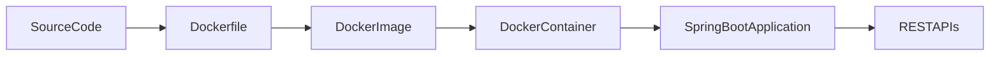

# Docker Deployment

The backend application can be packaged and executed using Docker. This provides a consistent runtime environment for local development and deployment.

The repository includes a `Dockerfile` for building the Spring Boot backend and a `docker-compose.yml` file to simplify container execution.

---

# Project Files

Docker-related files are located in the project root and backend directory.

```text
Load_Balancer_Simulator
│
├── docker-compose.yml
│
└── backend/
    └── loadbalancer-backend/
        └── Dockerfile
```

---

# Build the Image

Navigate to the backend project.

```bash
cd backend/loadbalancer-backend
```

Build the Docker image.

```bash
docker build -t load-balancer-backend .
```

This command packages the Spring Boot application into a Docker image.

---

# Run the Container

```bash
docker run -p 8080:8080 load-balancer-backend
```

The backend will be available at:

```text
http://localhost:8080
```

---

# Using Docker Compose

From the project root:

```bash
docker-compose up --build
```

Docker Compose builds the required image and starts the configured services.

---

# Verify Deployment

After the container starts:

1. Open

```text
http://localhost:8080/api/analytics
```

2. Confirm that the endpoint returns a valid JSON response.

3. Open the frontend and verify that requests are routed correctly.

---

# Deployment Flow



---

# Troubleshooting

### Docker is not installed

Verify installation.

```bash
docker --version
```

---

### Container exits immediately

Inspect the logs.

```bash
docker logs <container-id>
```

Review the reported error before restarting the container.

---

### Port already in use

If port **8080** is occupied:

```bash
docker run -p 8081:8080 load-balancer-backend
```

Update the frontend configuration to use the new backend port if required.
