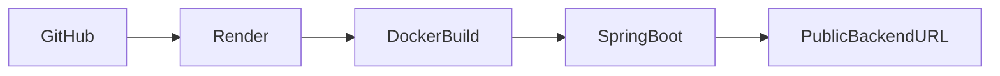

# Render Deployment

The backend is deployed as a **Render Web Service**.

Render automatically builds the application from the GitHub repository and starts the Spring Boot application using the provided Docker configuration.

---

# Repository

```text
Load_Balancer_Simulator
```

---

# Root Directory

```text
backend/loadbalancer-backend
```

---

# Runtime

| Setting | Value |
|---------|-------|
| Platform | Render |
| Environment | Docker |
| Runtime | Java 17 |

---

# Deployment Workflow



---

# Verification

After deployment, verify the following.

- Backend starts successfully.
- `/api/analytics` returns data.
- Routing APIs respond correctly.
- WebSocket connection is established.
- Frontend communicates with the deployed backend.

---

# Notes

The frontend should use the deployed Render URL instead of `localhost`.

During deployment, ensure that any frontend environment variables point to the Render backend.
