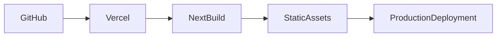

# Vercel Deployment

The frontend is deployed using **Vercel**.

Vercel builds the Next.js application directly from the GitHub repository and hosts the production build.

---

# Repository

```text
Load_Balancer_Simulator
```

---

# Root Directory

```text
frontend
```

---

# Deployment Workflow



---

# Production Communication

After deployment, the frontend communicates with:

- Render backend REST APIs
- Render WebSocket endpoint

No application logic runs inside Vercel.

Its responsibility is to serve the frontend application.

---

# Verification

Verify the following after deployment.

- Dashboard loads successfully.
- Routing algorithm can be changed.
- Simulation starts and stops correctly.
- Analytics are displayed.
- Server cards update through WebSockets.

---

# Notes

The frontend should be configured to use the deployed backend URL.

Do not use `localhost` in the production environment.
