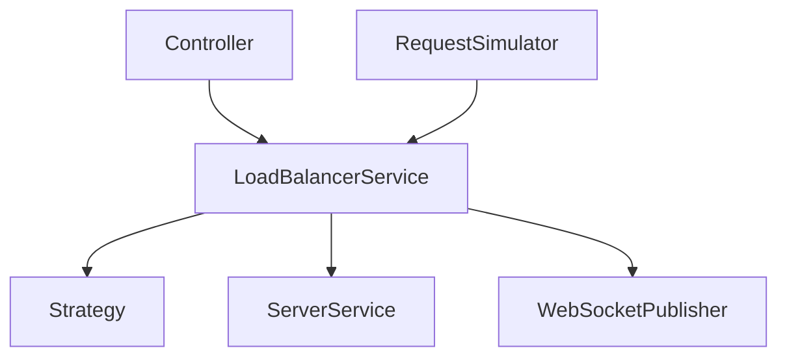

# Code Structure

The backend is organized into independent layers that collaborate during request processing.

---

# Request Flow

Every generated request follows the same execution path.

1. `RequestSimulator` creates a request.
2. `LoadBalancerService` receives the request.
3. The active routing strategy selects a server.
4. `ServerService` updates the selected server.
5. `WebSocketPublisher` broadcasts the updated state.
6. The frontend refreshes the dashboard.

---

# Responsibilities

| Class | Responsibility |
|--------|----------------|
| LoadBalancerService | Coordinates request routing |
| ServerService | Manages backend servers |
| RequestSimulator | Generates simulated traffic |
| WebSocketPublisher | Publishes server updates |
| AnalyticsController | Returns analytics |

---

# Design

Business logic is concentrated inside the service layer.

Routing algorithms are isolated using the Strategy Pattern, allowing the routing behaviour to change without modifying the overall request processing workflow.