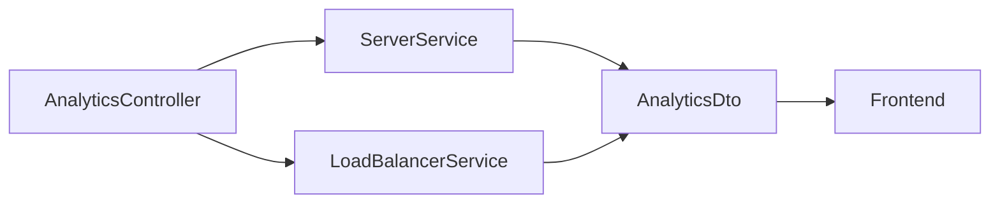
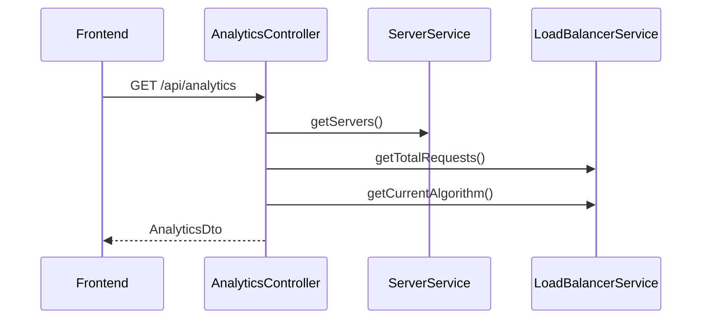

# Analytics Module

The Analytics module provides real-time information about the current state of the simulator. Instead of storing analytics separately, the backend calculates the required metrics from the current application state whenever the frontend requests them.

The analytics displayed on the dashboard always represent the latest state of the simulator.

---

# Purpose

The Analytics module provides runtime statistics that help users understand how requests are distributed across the simulated backend servers.

The current implementation reports:

- Total routed requests
- Number of active servers
- Total active connections
- Current load balancing algorithm

---

# Components

| Component | Responsibility |
|-----------|----------------|
| AnalyticsController | Exposes the analytics endpoint |
| AnalyticsDto | Defines the API response |
| LoadBalancerService | Provides routing statistics |
| ServerService | Provides server information |

---

# Endpoint

```http
GET /api/analytics
```

The endpoint returns an `AnalyticsDto` object.

Example response:

```json
{
  "totalRequests": 128,
  "activeServers": 4,
  "totalConnections": 31,
  "currentAlgorithm": "ROUND_ROBIN"
}
```

---

# Data Collection

When a request is received, `AnalyticsController` gathers information from the backend services.



The controller does not maintain its own state. It generates the response using the latest runtime information.

---

# Metrics

## Total Requests

Returned from `LoadBalancerService`.

Represents the number of requests successfully routed since the simulator started.

---

## Active Servers

Calculated using the current list of simulated servers.

Only enabled servers are included in the count.

---

## Total Connections

Calculated by summing the active connection count of every server.

---

## Current Algorithm

Obtained from the active `AlgorithmType` maintained by `LoadBalancerService`.

---

# Runtime Behaviour

Analytics are generated on demand.

Every call to `/api/analytics` returns the current state of the application.

No analytics history is stored.

---

# Request Flow



---

# Implementation Files

| File | Responsibility |
|------|----------------|
| AnalyticsController.java | Handles analytics requests |
| AnalyticsDto.java | Response model |
| LoadBalancerService.java | Provides routing statistics |
| ServerService.java | Provides server information |

---

# Design

The analytics module does not duplicate application state.

Instead, it calculates the response from existing services whenever requested. This keeps the implementation simple while ensuring the dashboard always displays the latest information.
