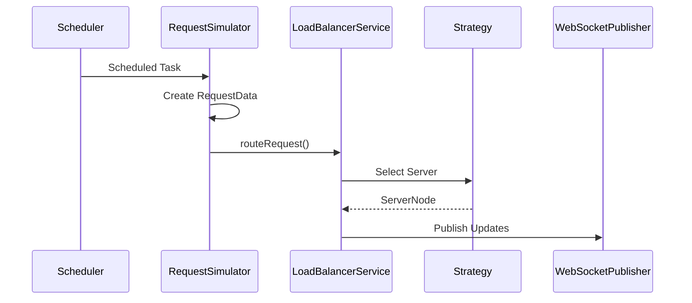

# Traffic Simulator

The Traffic Simulator generates synthetic client requests that drive the load balancing process.

Instead of waiting for external users, the simulator continuously creates requests and forwards them to the routing engine. This makes it possible to observe the behaviour of different load balancing algorithms in real time.

---

# Purpose

The simulator is responsible for:

- Generating requests
- Managing the simulation state
- Maintaining the request queue
- Forwarding requests to the routing engine

It does not perform request routing.

---

# Implementation

The simulator is implemented in:

```text
simulator/RequestSimulator.java
```

It operates independently from the routing algorithms.

---

# Scheduling

Request generation is handled using Spring Scheduling.

```java
@Scheduled(fixedRate = 2000)
```

Every two seconds:

- A new request is generated.
- The request is added to the queue.
- The request is forwarded to `LoadBalancerService`.

The scheduler runs continuously while the simulation is active.

---

# Request Queue

Generated requests are stored in:

```java
ConcurrentLinkedQueue<RequestData>
```

The queue maintains recently generated requests and is exposed through `RequestController`.

The queue exists only while the application is running.

---

# Simulation Workflow

```mermaid
flowchart LR

Scheduler

--> RequestSimulator

--> Create RequestData

--> Request Queue

--> LoadBalancerService

--> Routing Strategy

--> ServerNode

--> WebSocketPublisher

--> Frontend
```

---

# Simulation Control

Simulation is controlled through:

```http
POST /api/simulation/start

POST /api/simulation/stop

GET /api/simulation/status
```

`SimulationController` starts and stops the simulator by updating its running state.

---

# Request Lifecycle

For every scheduled execution:

1. Check whether the simulation is running.
2. Create a new `RequestData` object.
3. Store the request in the queue.
4. Pass the request to `LoadBalancerService`.
5. Route the request using the selected strategy.
6. Publish updated server information.

---

# Component Interaction



---

# Responsibilities

| Component | Responsibility |
|-----------|----------------|
| RequestSimulator | Generates requests |
| LoadBalancerService | Coordinates routing |
| Routing Strategy | Selects destination server |
| WebSocketPublisher | Publishes updates |
| RequestController | Returns request history |

---

# Design

The simulator focuses only on traffic generation.

Routing decisions remain inside `LoadBalancerService`, allowing the simulator and routing engine to evolve independently.

---

# Implementation Files

| File | Responsibility |
|------|----------------|
| RequestSimulator.java | Generates requests |
| RequestController.java | Returns request queue |
| SimulationController.java | Starts and stops simulation |
| LoadBalancerService.java | Routes generated requests |
